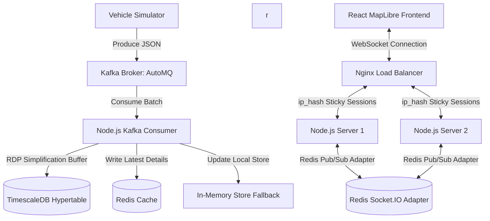

# Detailed Step-by-Step Workflow: Real-Time Vehicle Tracking

This document details the production-level system architecture, data pipelines, scaling strategies, and containerization details for the horizontal-scale real-time vehicle tracking platform. The system is designed to support **10,000+ concurrent global vehicle streams** with smooth real-time visualization on a React dashboard.

---

## 1. System Architecture & Tech Stack

The architecture is divided into three primary tiers: high-throughput event ingestion (Kafka), low-latency caching and real-time distribution (Redis, Socket.IO, Nginx), and persistent time-series data storage (TimescaleDB).



### Frontend Stack
* **React & Vite**: Fast SPA framework with optimized builds.
* **Tailwind CSS**: Modern CSS library for glassmorphic, responsive, and theme-adaptive dashboards.
* **MapLibre GL JS**: High-performance GPU-accelerated map rendering engine utilizing vector tiles.
* **Zustand**: Clean, lightweight global state store handling rapid vehicle delta updates.
* **Socket.IO Client**: Bidirectional WebSockets with automated reconnection and fallback protocols.

### Backend Stack
* **Node.js & Express.js**: REST API routing, server logic, and simulation coordinator.
* **Socket.IO Server**: Low-latency event streaming supporting horizontal scaling via adapters.
* **Redis**: Microsecond-latency in-memory cache handling global geospatial telemetry and inter-server pub/sub.
* **Kafka (AutoMQ)**: Distributed event broker buffering high-velocity simulator payloads.
* **TimescaleDB (PostgreSQL)**: Optimized time-series database managing historical trajectories and continuous data archival.

### Infrastructure & Deployment
* **Nginx**: Reverse proxy and load balancer configured with sticky sessions (`ip_hash`) and WebSocket header passthroughs.
* **Docker & Docker Compose**: Containerized services allowing isolated orchestration of infrastructure (Kafka, Redis, TimescaleDB) alongside the application services.

---

## 2. Backend Implementation Details & Optimization

### A. Vehicle Simulator & Geo-Independence
* **Global Distribution**: Generates realistic coordinate drift across the entire globe for 10,000 vehicles, completely decoupled from rigid country-bound fallbacks.
* **Anti-Meridian Calculation**: Handles coordinate transitions across the ±180° longitude line (Anti-Meridian) to avoid visual jumps and map-wrapping errors.
* **Decoupled Simulation Loops**: The simulation can be toggled off (`START_SIMULATOR=false`) via environment variables on pure consumer nodes to prevent duplicate data generation in a distributed multi-node topology.

### B. High-Throughput Kafka Ingestion
* **Batch Processing**: Consumer fetches telemetry in chunks, mitigating the `KafkaJSNoBrokerAvailableError` by avoiding broker starvation under heavy loads.
* **Heartbeat Keeping**: Integrated keep-alive signals inside long-running database bulk inserts to prevent Kafka coordinators from marking nodes as dead.
* **Consumer Groups**: Configurable `KAFKA_GROUP_ID` enables multiple consumer instances to partition incoming message streams, scaling processing horizontally without message duplication.

### C. Geospatial Redis Cache & Fallback Store
* **Real-time Caching**: The consumer updates Redis with the latest coordinates (`geoAdd` to a sorted set) and full vehicle details (serialized JSON inside a Redis Hash `vehicle_details`).
* **Redis GeoSearch Queries**: Custom Express API and Socket.IO handshake viewport requests leverage `redisClient.geoSearch` to pull vehicles within active bounding boxes.
* **In-Memory Fallback**: If Redis or Kafka disconnects, the system automatically routes queries to a local, thread-safe in-memory store (`vehicleStore.js`) to guarantee system uptime.

### D. TimescaleDB RDP Simplification Pipeline
* **RDP Buffer Optimization**: Telemetry streams are first stored in a memory map and batch-processed every 10 seconds through the Ramer-Douglas-Peucker (RDP) algorithm with a tolerance factor ($0.0001$ degrees, approx. 11 meters).
* **Noise Reduction**: Static vehicles or minor GPS drift points are discarded, reducing database write amplification and saving storage.
* **Hypertable Bulk Inserts**: Retained key trajectory nodes are flushed in dynamic chunks (size 1000) using parameterized multi-row SQL statements to prevent query parser overflows.
* **7-Day Retention Policy**: Automatic rolling partitioning of TimescaleDB tables drops chunks older than 7 days, maintaining index performance.

---

## 3. Horizontal Scaling & Real-time Synchronization

To scale out to multiple server instances, the following mechanisms were integrated:

### A. Nginx Sticky Load Balancer
* **Session Affinity**: Nginx uses `ip_hash` to ensure all HTTP handshake requests and subsequent WebSocket polling packets from a single client target the same Node.js backend.
* **Keep-Alive Configuration**: Connection timeouts are raised to 24 hours (`proxy_read_timeout 86400s`) to prevent proxy drops on idle WebSocket channels.
* **Buffer Disabling**: `proxy_buffering off` is configured to deliver websocket data downstream immediately.

### B. Socket.IO Redis Adapter
* **Pub/Sub Broker**: Implements `@socket.io/redis-adapter` using a duplicated Redis client.
* **Cross-Instance Broadcasts**: When a consumer node updates vehicle coordinates, the event is published to the Redis channel and broadcast by all running backend nodes, ensuring all clients receive updates regardless of which specific server they are connected to.

```
[Server 1 (Client A)] <--- (Pub/Sub Broadcast) ---> [Redis Pub/Sub] <--- (Pub/Sub Broadcast) ---> [Server 2 (Client B)]
```

---

## 4. Frontend Optimization & Rendering

### A. WebGL Layer & MapLibre GL JS
* **GeoJSON Source Binding**: Avoids React component lifecycle overhead. 10,000 vehicles are compiled into a unified GeoJSON source and loaded into the GPU.
* **Supercluster Integration**: Groups dense markers at low zoom levels into aggregate clusters, maintaining high FPS.
* **Targeted Viewport Subscriptions**: The map dynamically emits bounding-box queries (`subscribeToViewport`) on drag/zoom. The backend only pushes updates for vehicles inside the user's visible viewport.

### B. UI Rendering & Fluid Animation
* **Single-Pass Calculations**: Dashboard metrics (active, idle, speeding counts) are calculated inside a single traversal, eliminating state churn and UI micro-freezes.
* **Marker Interpolation**: Utilizes `requestAnimationFrame` to interpolate coordinates smoothly between updates, rendering fluid movement instead of sudden teleportations.
* **Adaptive Map Theme**: Top-right map style toggle swaps Carto light/dark tile URLs, adjusting visual contrast parameters of overlays.

---

## 5. End-to-End Data Pipeline

1. **Simulation Generator**: Writes simulated GPS telemetry streams to Kafka.
2. **Kafka Partitioning**: Distributes streams across active consumer nodes.
3. **Consumer Execution**:
   - Updates local thread state.
   - Pushes current states to the Redis Cache (`geoAdd`, `hmSet`).
   - Appends trajectories to the local RDP compression queue.
4. **RDP Database Flush**: Every 10 seconds, simplified trajectory vertices are bulk inserted into the TimescaleDB hypertable.
5. **Real-time Event Broadcast**:
   - Updates are batched into 100ms delta packets.
   - Socket.IO servers utilize the Redis Pub/Sub adapter to sync event frames across all Node instances.
   - Nginx proxy routes packets down to the correct clients.
6. **Frontend Map Draw**: MapLibre translates updates to GPU-rendered coordinates, and Zustand updates state counters without rebuilding DOM trees.

---

## 6. Containerization & Configuration Management

The system is fully containerized for simplified orchestration and deployment:

| Service | Technology | Internal Port | External Port | Key Environment Configurations |
| :--- | :--- | :--- | :--- | :--- |
| **Redis** | `redis:7-alpine` | 6379 | 6379 | Standard memory configuration |
| **TimescaleDB** | `timescale/timescaledb` | 5432 | 5433 | `POSTGRES_DB`, `POSTGRES_PASSWORD` |
| **Zookeeper** | `zookeeper:latest` | 2181 | 2181 | Zoo server configurations |
| **Kafka** | `cp-kafka:5.5.12` | 29092 | 9092 | Advertised listeners, listener mapping |0
| **Backend** | Custom Node.js (Alpine) | 3000 | 3000 | `REDIS_URL`, `KAFKA_BROKERS`, `POSTGRES_URL` |
| **Frontend** | React SPA (Vite) | 5173 | 5173 | `VITE_API_URL` |